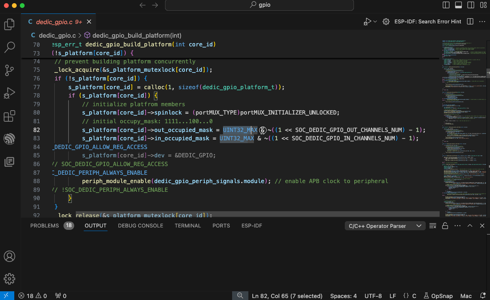

# OpSnap - A VSCode Extension for C/C++ Developers

**OpSnap** is a powerful tool designed for C/C++ developers to simplify complex expressions by breaking them down into manageable components. It helps enhance code readability and understanding by transforming intricate expressions into simple ones with just two operands and an operator.

## Features
- **Expression Breakdown**: OpSnap takes complex C/C++ expressions and breaks them into simpler forms, making code easier to read and maintain.
- **Status Bar Integration**: Select one or more lines of expressions, and with a single click on the **OpSnap** button in the bottom-right corner of the status bar, see the parsed result displayed in the output window.
- **Operator Precedence Lookup**: Quickly access the complete C/C++ operator precedence list by typing `c_cpp_op_snap` in the VSCode command palette.

## Installation

1. Open VSCode.
2. Go to the Extensions Marketplace.
3. Search for `c-cpp-op-snap`.
4. Click **Install**.

Alternatively, you can install the extension from a `.vsix` file by opening the Command Palette (`Ctrl+Shift+P`), selecting `Install from VSIX...`, and choosing the `.vsix` file.

## Usage

1. **Breaking Down Expressions**:
   - Select a line or multiple lines of C/C++ expressions in your editor.
   - Click the **OpSnap** button in the bottom-right corner of the status bar.
   - The parsed results will be displayed in the output window.
   

2. **Operator Precedence List**:
   - Open the command palette by pressing `Ctrl+Shift+P`.
   - Type `Opsnap` to instantly retrieve the full C/C++ operator precedence list.

## Contributing

Contributions are welcome! If you encounter bugs or have suggestions for improvements, feel free to open an issue or submit a pull request on the [GitHub repository](https://github.com/KAJESPER/c-cpp-op-snap).

## License

This project is licensed under the MIT License.

## Support Me

If you enjoy my work and would like to support me, please consider buying me a coffee: [Buy Me a Coffee](https://www.buymeacoffee.com/你的用户名).

